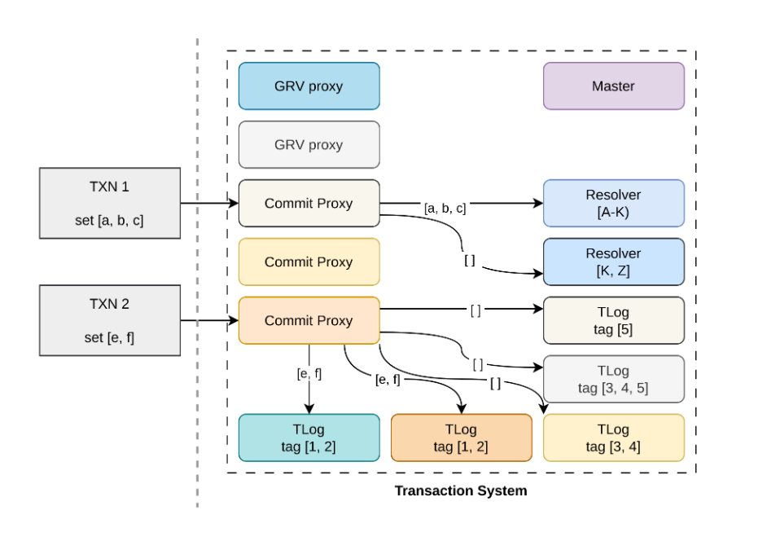

前一篇文章介绍了 FoundationDB 只读事务的处理流程。到此为止，已经介绍完整个 FoundationDB 的基本读写流程以及过程中所涉及的关键组件。现在开始将陆续介绍 FoundationDB 的分布式属性，这篇文章将重点关注 FoundationDB 的可扩展性。

# 事务系统的扩展

首先是事务系统的扩展。Master 节点负责分配事务 version，由于分配操作本身非常高效，它不是系统中的瓶颈，所以不参与扩展。

GRV proxy 和 Commit proxy 本身没有任何状态，所以它们的扩展方式是直接增加数量。Client 在访问 GRV proxy 和 Commit proxy 时，会从 `ClientDBInfo` 中随机选择一个节点访问。

## Resolver

重点是扩展 Resolver 和 TLog 。扩展 Resolver 的方式是让每个 Resolver 只负责处理一段区间的事务冲突，不同 Resolver 处理的区间不重叠。这样 Commit proxy 需求将事务涉及的 key 按照处理区间分组，按组发送给不同 Resolver 处理。为了保证每个 Resolver 所处理事务的连续，即时某个事务涉及的 key 与某个 Resolver 处理的区间没有交集，Commit proxy 也需要发送空请求给 Resolver。

上图有一个例子，图中的 `TXN 1` 提交了一个事务 `set [a, b, c]`，而系统中有两个 Resolver，分别负责处理 `[a, k)`，`[k, z)` 的请求。因为 `TXN 1` 涉及的 key 只与 Resolver 1 有交集，所以 `[a, b, c]` 均被发送给 Resolver 1 处理；而为了推进 Resolver 2 的事务冲突处理流程，Commit proxy 发送了一个空请求 Resolver 2。

多个 Resolver 可能对一个事务返回不同的结果，只有所有 Resolver 都判断事务能够提交，事务才能被提交；任一 Resolver 判断事务与之前提交的事务存在冲突，那么该事务就不能被提交。

需要注意的是，Resolver 会把能提交的事务记录在 write conflict range 中，那么可能一个事务在某个 Resolver 上被判断为冲突，但是它涉及的修改则被记录在另一个 Resolver 中，后续的事务可能会与一个因冲突而未被提交的事务发生冲突。针对这种情况 FoundationDB 的说法是 Resolver 的 write conflict range 记录会在 MVCC 窗口（默认 5s）过期后清理，所以用户只需要等待一段时间再重试，最终是能提交成功的。

## TLog

扩展 TLog 所涉及的概念则要多一些，它涉及到 Storage 的扩展。FoundationDB 将数据按照范围进行划分（Partition），不同 partition 被分配到不同 Storage 中；每个 Storage 可以服务多个 partition。同时 FoundationDB 还为每个 Storage 分配了一个唯一 ID，通过 partition range 到 Storage ID 的映射关系，可以快速找到负责提供某个 key 服务的 Storage。这个映射关系记录作为元数据存储在 FoundationDB 中，同时 Commit proxy 的内存中也会维护一份（称为 `keyinfo`）。

扩展 TLog 时，FoundationDB 会为不同的 TLog 分配不同的 tag。Commit proxy 在发送请求时，查询 `keyinfo`，按照 tag 对请求进行分组。这样 Storage 拉取数据的时候，只需要从 tag 匹配的 TLog 拉取即可。

上图中的另一个例子描述了场景。事务 `TXN 2` 修改了 `[e, f]`，假设 `[e, f]` 由 tag 为 2 的 Storage 提供服务，那么 Commit proxy 将把 `[e, f]` 的改动发送给拥有 tag `[1, 2]` 的那两个 TLog。同 Resolver 一样，为了推进 TLog 中记录的事务的顺序，即时某个事务的改动不涉及某些 TLog，Commit proxy 仍需要发送空情况给那些 TLog。

总结一下，扩展事务系统要求请求发送给集群中的所有 Resolver 以及 TLog，只有这些请求都成功收到响应，事务才算提交完成。那么任意一个 Resolver 或者 TLog 故障，整个事务系统将无法工作，这个问题将在后续介绍容灾能力的文章中解决。用户数据按照范围划分为 partition，并由不同 storage 提供服务，但是单机磁盘容量和处理能力总是有上限的，在下一篇文章中，将介绍 FoundationDB 是如何通过数据迁移来解决这个问题的。
