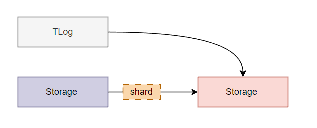
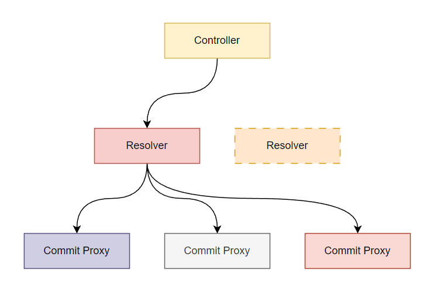
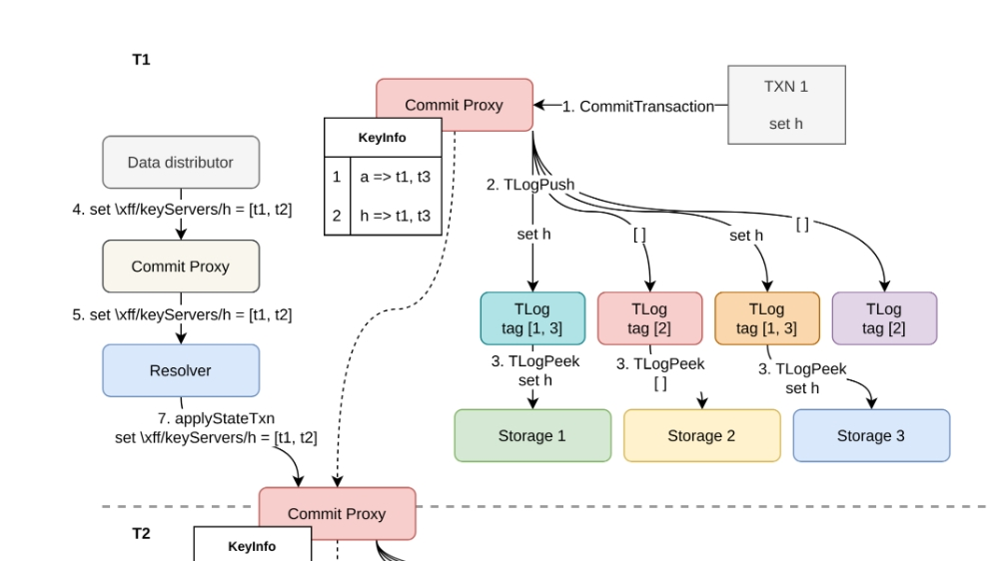
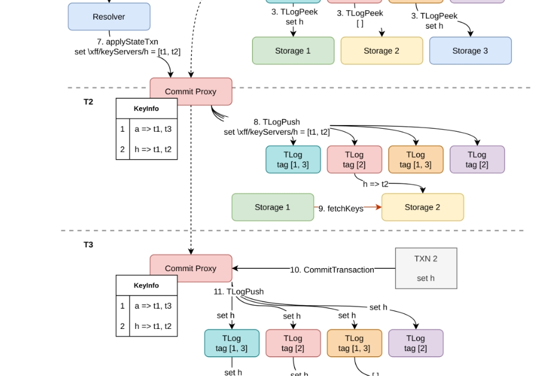
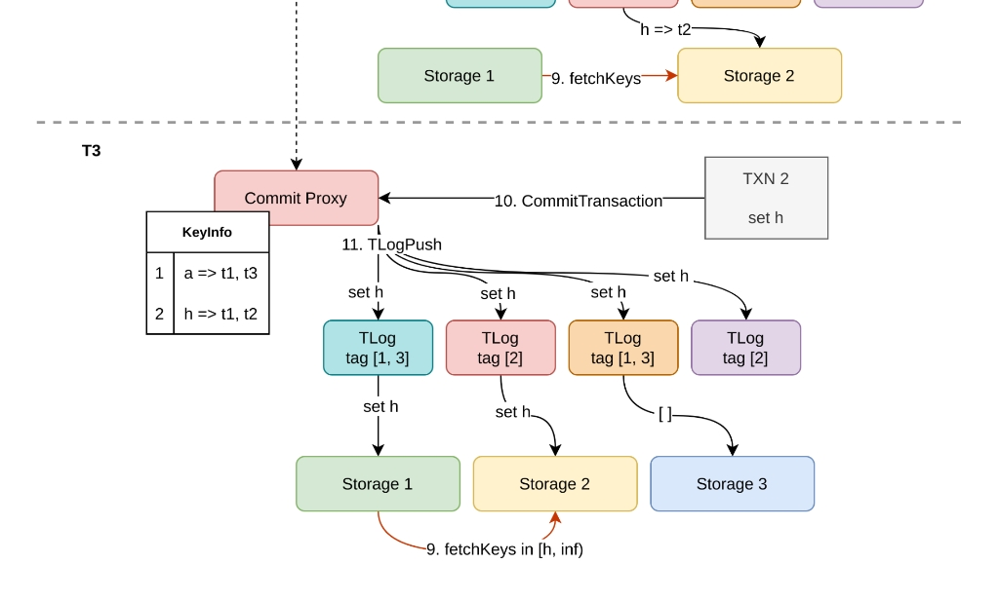

在前一篇文章中提到过 FoundationDB 处理 storage 扩展的方式：将数据按照 range 切分为多个 partition，每个 storage 只负责存储一部分 partition。这篇文章将对这部分内容做更深入的介绍。

## 数据迁移

数据迁移是 FoundationDB 存储系统的扩展能力的基石。数据迁移又可以分为迁出和迁入。迁出部分比较简单，直接将数据删除即可，因此这里只介绍迁入的实现。

数据迁入的最小单元是 shard。每个 shard 迁入有两部分工作：

1. 拉取存量数据
2. 同步增量数据。

> 注：前一篇文章介绍分片时使用的是 partition，属于笔误；实际上在 FoundationDB 中应该使用 shard。

当 storage 接收到 `MoveIn` 命令时，它会向共同维护该 shard 副本的其他 storage 发送 `fetchKeys` 请求。`fetchKeys` 请求会按照顺序一条条地从源 storage 拉取日志，并保存到目标 storage 的磁盘中。

### 与事务系统的配合

相较于获取存量数据，获取增量数据的过程要更为复杂。因为这里涉及到与事务系统的配合：即在事务提交过程中无感地进行数据的迁移。之前已经提到过，每个 storage 只会向拥有相同 tag 的的 TLog 获取拿属于它的那部分数据。因此同步增量数据需要解决的问题，就是如何在事务进行过程中将数据写入到负责向 storage 提供数据的 TLog 中。

而这个问题的难点在于系统中存在多个 commit proxy，每个 commit proxy 会按照自己内存中记录的路由表：`keyinfo` 将数据发送给某个 TLog 。因此如何在同一时间修改所有 commit proxy 中记录的 `keyinfo` 就成了问题的关键。

在 FoundationDB 中，事务间的顺序是通过 master 分配的事务版本顺序决定的；且只有在集群中所有的 resolver 都判断事务可以提交，事务才能被发送给 TLog 进行持久化。因此任何对元数据的修改可以通过 resolver 全序广播给所有的 commit proxy。

对于迁入操作，controller（中的 data distributor） 通过将修改发送给任一 resolver，并经由 `ResolveTransactionBatchResponse` 广播给 commit proxy；后者修改内存中记录的 `keyinfo` 并将数据发送给负责提供数据给目标 storage 的 TLog 中。

最后，`fetchKeys` 在执行时，storage 仍然会处理从 TLog 处拉取的数据，不过这部分数据需要等待 `fetchKeys` 阶段完成后才能被更新到存储中。

### example

下面来看一个数据迁移的例子。假设 commit proxy 的 `keyinfo` 中有两条记录：
1. `[a, h)` 路由到 `t1,t3`；
2. `[h, inf)` 路由到 `t1,t3`。

> `t1,t2,t3` 是 storage 1,2,3 的 tag

那么在时刻 T1，事务 `set h` 将被发送给从左到右的第一、三个 TLog 进行持久化。

现在 data distributor 发现数据不均衡，因此决定将 `[h, inf)` 的一个副本从 `t3` 迁移到 `t2` 中。它修改元数据 `keyServers`，将 `[h, inf)` 映射到 `t1,t2`，并通过 resolver 广播给 commit proxy。

在时刻 T2，commit proxy 根据 `keyServers` 修改 `keyinfo`，并把改动同步给每个 TLog；最后 storage 2 根据 `keyServers` 的指示接收副本，并通过 `fetchKeys` 从 storage 1 中拉取存量数据。

因此在时刻 T3，另一个事务执行 `set h` 时，将被发送给所有带有 tag `t1,t2` 的 TLog 进行持久化。

最后 storage 1,2 将从对应的 TLog 拉取到对 `h` 的更新，而 storage 3 则不会。

## 负载均衡、分裂合并

当集群容量接近上限时，需要增加新机器对集群进行扩展。FoundationDB 会根据磁盘使用空间对数据进行迁移，最终实现不同机器的磁盘使用空间的负载均衡。

此外，因为每个 shard 有多个副本，FoundationDB 的 client 还会根据读请求的延迟选择最优的副本进行读取，实现读读请求的负载均衡。

写请求的负载均衡则是通过分裂和迁移完成的。分裂操作不涉及数据的迁移，只需要修改元数据映射关系。FoundationDB 会按照写带宽对 shard 进行分裂，默认分裂阈值为：过去 1000 秒内平均写入达到 250KB/s。对存在热点写入的 shard，通过采样找到合适的分裂点执行分裂，再配合数据迁移，就能将写入压力分摊到不同的 TLog 和 storage 中。

另外因为每次迁移的最小单位是 shard， FoundationDB 还会根据 shard 大小自动进行分裂、合并，以控制每次迁移是传输的数据量。Shard 的大小通常控制在 128 ~ 512 MB 内，随 Database 总体容量增长而增长。
