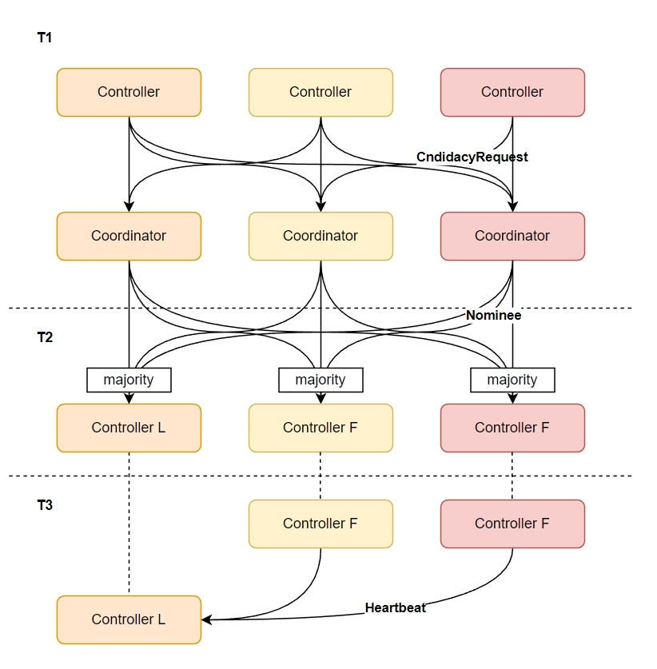
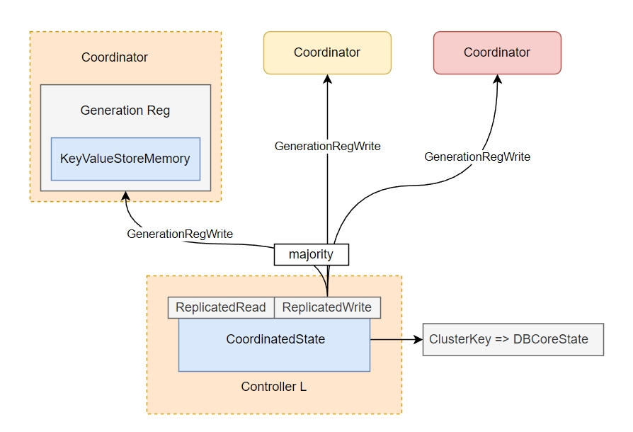
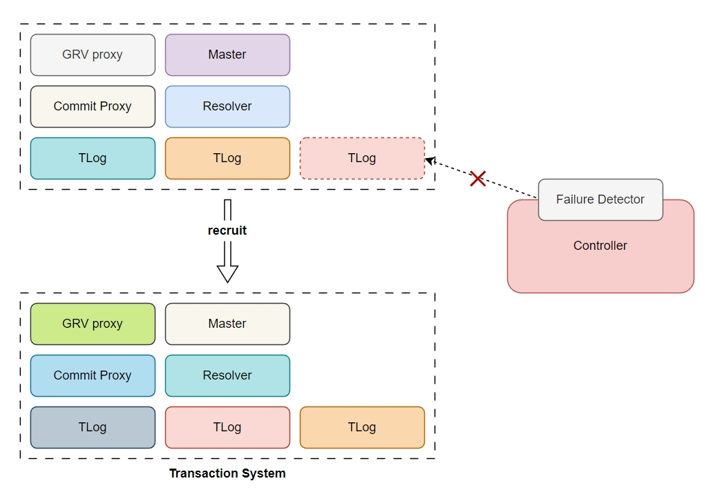

前两篇文章已经完整地介绍了 FoundationDB 的扩展能力，这一篇文章将介绍 FoundationDB 架构的最后一部分：FoundationDB 的容错。

从实现机制上讲，FoundationDB 的容错可以按照数据组织方式划分为三部分：控制系统容错、事务系统容错、存储系统容错。


## 控制系统

控制系统中参与容错的重要角色是 coordinator，它背后的分布式一致性算法 paxos 为它提供了容错能力。大多数分布式系统工作在异步、非拜占庭消息模型下，依靠多副本提供容错能力；paxos 算法解决了该模型下多副本间数据的一致性问题。在 paxos 算法的加持下，FoundationDB 在只要集群中仍有多于半数的 coordinator 节点存活时（无故障、无网络隔离），就能对外提供服务。由于 paxos 不是本文重点，所以不做更多介绍，更多关于 paxos 算法的细节可以阅读论文《paxos made simple》。

> The Paxos algorithm, when presented in plain English, is very simple.  Leslie Lamport

FoundationDB 中的 coordinator 角色是用户手动设置的，下面是一个例子：

```
user@host$ fdbcli
Using cluster file `/etc/foundationdb/fdb.cluster'.

The database is available.

Welcome to the fdbcli. For help, type `help'.
fdb> coordinators 10.0.4.1:4500 10.0.4.2:4500 10.0.4.3:4500
Coordinators changed
```

用户设置的 coordinators 会与 cluster key 一起组成 cluster 的唯一标识，并保存到 `fdb.cluster` 文件中；sdk 可以通过该文件找到 coordinator 并操作 FoundationDB 集群。

### 选主

Coordinator 的第一个职责是协调并选举出一个合适的 controller 成为 leader，只有成为 leader 的 controller 才能开始工作；controller 负责管理整个 FoundationDB 集群，并使之能够对外提供服务。新加入集群中的节点如果一段时间未接收到来自 leader 的心跳，则会触发新一轮选举，直到选出新的 leader 为止。



选举开始时，controller 会发送 `CandidacyRequest` 给所有 coordinator。Coordinator 会按照一定规则选择出优先级最高的 controller 作为被提名人（Nominee）广播给 controller。当某个 controller 在一轮选举中收到超过半数节点的提名就会成为 leader。新 leader 上任后，会定期广播心跳给其余节点，以抑制后者发起新选举的流程。

### Coordinated State

Coordinator 的第二个职责是负责提供元数据的容错。



每个 coordinator 会提供 `GenerationReg` 的读写服务，它扮演了 paxos 算法中的 acceptor 角色：对于读写请求，会各自携带一个读写 generation，而 `GenerationReg` 保证了只响应不小于已经恢复的 generation 的请求。Leader controller 则通过组件 `CoordinatedState` 读写 `GenerationReg`。`CoordinatedState` 组件扮演了 paxos 算法中的 proposal 角色，它通过 `ReplicatedWrite` 和 `ReplicatedRead` 来保证对 `GenerationRegs` 读写的线性一致性。

`GenerationReg` 和 `CoordinatedState` 一起组成了一个线性一致的 key-value store。实际上，这个 key-value store 中只存储了一条记录：`ClusterKey` => `DbCoreState`。其中 `ClusterKey` 是记录在 `fdb.cluster` 中的 `description` 和 `id`，`DBCoreState` 中则记录了事务系统的元数据，其中最核心的是 TLog 的拓扑以及数据分布。

### 服务发现

`fdb.cluster` 在 FoundationDB 中负责提供集群的服务发现。因为 coordinator 是用户手动配置的，因此如果任何一个 coordinator 宕机，都需要人工设置新的 coordinators 进行替换。当 coordinators 发生变更时，`fdb.cluster` 中记录的内容也需要同步变更。FoundationDB 的 client 会监控集群 leader 的变化，一旦发现 leader 中记录的 coordinators 与本地文件中记录的不同，则会用新的记录更新本地 `fdb.cluster` 文件。对于 sdk，只有 `fdb.cluster` 有读写权限时才会主动更新。

实际上 FoundationDB 也提供了一种自动配置 coordinators 的方式，只需要在 `fdbcli` 中执行下列命令即可：

```
fdb> coordinators auto
```

在该设置下，FoundationDB 如果发现 coordinator 中某个节点出现故障，则会自动选择合适的节点组成新的 coordinators。

## 事务系统

FoundationDB 的 fdbserver 的核心逻辑在 worker 中，worker 提供了一系列 recruit 接口，用于在 worker 内启动各式各样的 actor，包括 master, TLog, storage, commit proxy, GRV proxy。worker 启动后会发送 `RegisterWorkerRequest` 将自己注册到 leader controller 中。Leader controller 负责按照用户配置启动事务系统中的各个成员，并监控后者的状态。如果事务系统的任何一个成员被监控系统判断为失恋、故障，则 controller 会触发一次事务系统的 recovery。



Recovery 就是从一系列 worker 中选择合适的 worker，并 recruit 出事务系统所需要的 actors 的过程。这个过程中需要保证元数据的持久性，同时还需要保证新旧事务系统切换时的一致性。

### Lock TLogs

因为事务系统切换时旧的事务系统仍然可能在提交一些事务请求，所以 recovery 需要锁住旧事务系统的 TLogs。这个过程中 recovery 会发送 `TLogLock` 请求给 TLogs，收到该请求的 TLog 会拒绝新事务提交请求，并返回本地记录的已提交的事务 version （`knownCommittedVersion`，KCV）和已经持久化的最大 version（`durableVersion`，DV）。一旦 TLogs 被锁住，旧事务系统中正在进行的事务将不会得到提交。这一点与其他的日志系统类似，比如 LogDevice, pulsar。旧事务系统的元数据记录在 `CoordinatedState` 里，recovery 一开始需要先从 coordinators 中读取该数据。

实际上，FoundationDB 的写入请求需要提交给系统中的所有 TLog 完成持久化后才能返回，所以理论上只需要任何一个 TLog 响应 `TLogLock` 请求，就不会有新请求被提交了。但是实现时还需要获取已经提交事务的进度，所以需要等待至少 `logServers.size() - logReplicationFactor + 1` 个响应后上锁阶段才会结束。（`logReplicationFactor` 是一份日志的冗余数，上式的含义是保证每个日志至少有一个副本响应 `TLogLock` 请求）。

> 上面的说法并不绝对，因为 FoundationDB TLogs 还有一项 `antiQuorum` 的配置，它允许 TLog 在收到 `logServers.size() - antiQuorum` 个响应时立即返回。不过由于这项配置会损害 TLog 副本冗余度，已经不建议使用了。

### Recovery txn state store

一旦旧事务系统被锁定，recovery 就回尝试从旧 TLogs 中读取事务系统的元数据，它们包括：
- `versionEpochKey`
- `configKeys`
- `tagLocalityListKeys`
- `serverTagsKey`

后两个已经在前面的文章中介绍过，`configKeys` 中记录着 FoundationDB 集群中的各项配置，`versionEpochKey` 中记录集群建立时的 unix epoch，也是整个系统的 version 0。这些元数据以及 recovery 过程中产生的状态，会作为一个事务提交到新事务系统中，这样保证新事务系统触发 recovery 时也能读到事务系统的元数据。

### Recovery txn version

此外，为了保证分配的事务 version 是递增的，controller 会在最小 DV 的基础上增加 `MAX_VERSIONS_IN_FLIGHT` 作为 `recoveryTransactionVersion` 发送给新 master，master 会在 `recoveryTransactionVersion` 的基础上开始分配新的 version。

> MAX_VERSIONS_IN_FLIGHT = 100 * VERSION_PER_SECOND
> VERSION_PER_SECOND     = 1e6

### Recovery txn

Recovery 还需要解决一个问题：已经返回给用户的事务必须能在恢复后读取到。回忆一下 commit proxy 处理流程的最后一部分：当所有 TLog 都完成事务持久化后，commit proxy 响应用户事务已经提交。因此可以通过计算最小的 DV 找到可能已经响应用户的事务 version 的上界，同时可以通过最大的 KCV 找到已经响应的事务 version 的下界。Recovery 过程需要 `[KCV+1, DV]` 中的事务复制到新 TLogs 中并提交，以保证系统的外部一致性。

对于大于 DV 的日志，将会从系统中丢弃。不过这部分日志可能已经被 storage 缓存到内存中，当 storage 观测到新 TLogs 时需要从内存中丢弃数据。

### Accept commits

在 recovery 的最后阶段，controller 会发送第一个 `ResolveTransactionBatchRequest` （`prevVersion == -1 && version == lastEpochEnd`）给所有的 resolver，从而允许 resolver 开始接受新的读写请求。同时 controller 还会将新 TLogs 元信息持久化到 `CoordinatedState` 中。到这个阶段后，事务系统就可以接受用户的写入了。

### 两种异常情况

一个异常情况是如果在 recovery 过程中发现 TLogs 中记录的元数据不足以支撑恢复流程，就需要用户使用 force recovery 进行恢复。这个过程中可能会丢失已经提交的数据。另一个异常情况时在 recovery 过程中又有旧 TLogs 故障，导致计算出来的 KCV 回退，那么 controller 会终止本次 recovery 并启动一次新的 recovery。

### 服务发现

FoundationDB 集群内部通信时的服务发现由 controller 提供，controller 的地址来自 `fdb.cluster` 文件。集群内每个组件的地址会记录在 `ServerDBInfo` 中，比如 resolvers, commit proxies, GRV proxies；通过 `ServerDBInfo`，集群中的任何一个组件可以快速找到目标组件的地址；任何一个地址的变更都会通过 controller 广播给集群中的所有 worker。

对于 client，只有 `CoordinatedState` 完成持久化后，controller 才会将新事务系统的配置广播给所有 clients。

## 存储系统

和前两个系统相比，存储系统的容错过程则简单得多。Leader controller 会启动一个 Data Distributor 服务，后者监控集群中的副本状态，如果有一个副本失联，那么它会选择一个合适的 storage，并发送 `MovingShard` 请求给该 storage。收到 `MovingShard` 请求的 storage 将会从剩余的健康 storage 中拉取存量数据；这个过程中它也会从 TLog 中拉取增量数据，但是增量数据会缓存在内存中，直到所有存量数据都拉取完并完成持久化。
